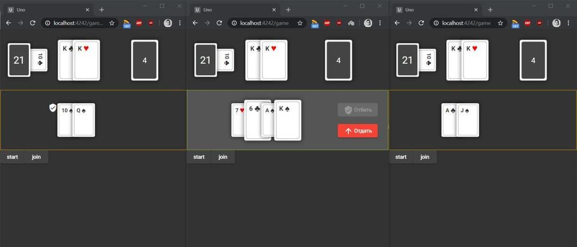
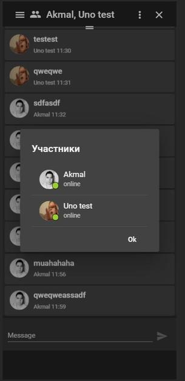
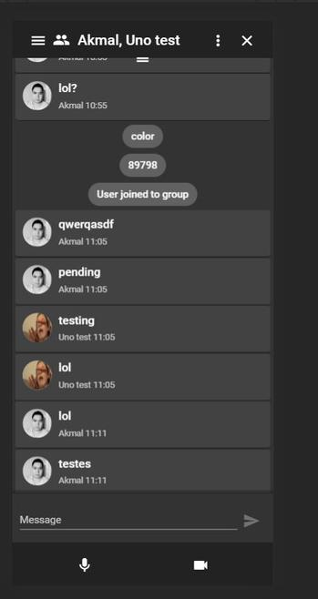
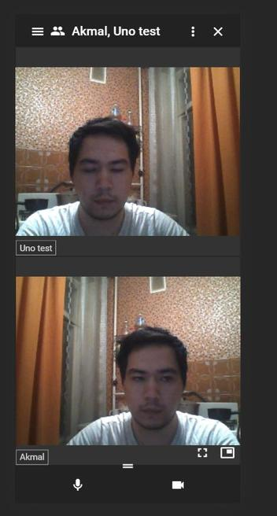
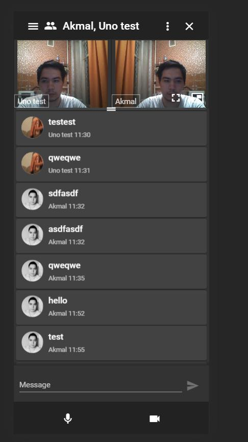
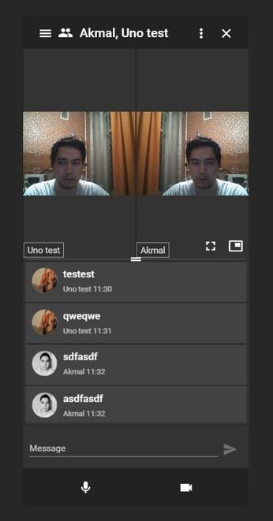
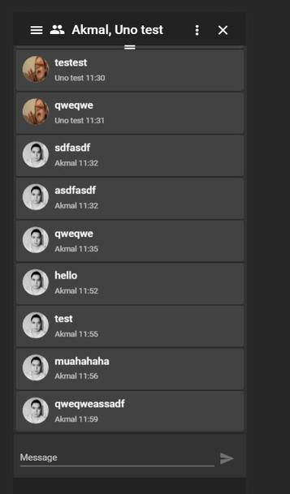

# Uno

Video, audio and text based chat application.

## Demo

[https://akmalkrmv.github.io/uno](https://akmalkrmv.github.io/uno/)

## Used technolgies

For video audio calls used WebRTC technology, for signalling used Firebase.
Firebase as backend, data management, push notifications. 

## Preview

## Roadmap

- Simple authentication
- Creating and joining rooms
- Making and receiving audio/video calls
- Authentication with socials: Google, Facebook, Github
- Chatting within a room via text, with or without calls
- Administrating user data, CRUD operations
- Live editing same code or text by multiple users with or without calls
- Simple multiplayer games
- Localization for multiple languages
